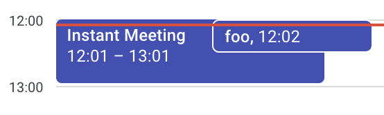

# gcall
GCALL creates instant Google Meet meetings via the terminal to avoid the need for clicking multiple buttons in the Google UI.

The meeting is created with the default settings of 'Instant Meeting' and 60 minutes duration. The meeting name and duration can be customized via the command line arguments.

The output of the command is the meeting URL link that can be shared with others.
If `pbcopy` is available on the system, the meeting URL is copied to the clipboard.


## Prerequisites

To use this tool, you need to have a Google account and have enabled the Google Calendar API for your account.

### 1. Enable the Google Calendar API

Follow the steps in the [Google Calendar API Quickstart](https://developers.google.com/calendar/quickstart/go) to enable the Google Calendar API for your account.

### 2. Download the credentials.json file

After enabling the Google Calendar API, download the `credentials.json` file and save it in the user home directory.

## Installation

```bash
go install github.com/abhishekkr/gcall@latest
```

## Usage

```bash
### 1. Create a Googe Calendar Meeting with default settings (name as 'Instant Meeting' and duration as 60 minutes)
$ gcall

### 2. Create a Googe Calendar Meeting with custom name and duration
$ gcall -name "My Meeting" -duration 30
```

## Example




## License

[MIT](LICENSE)
